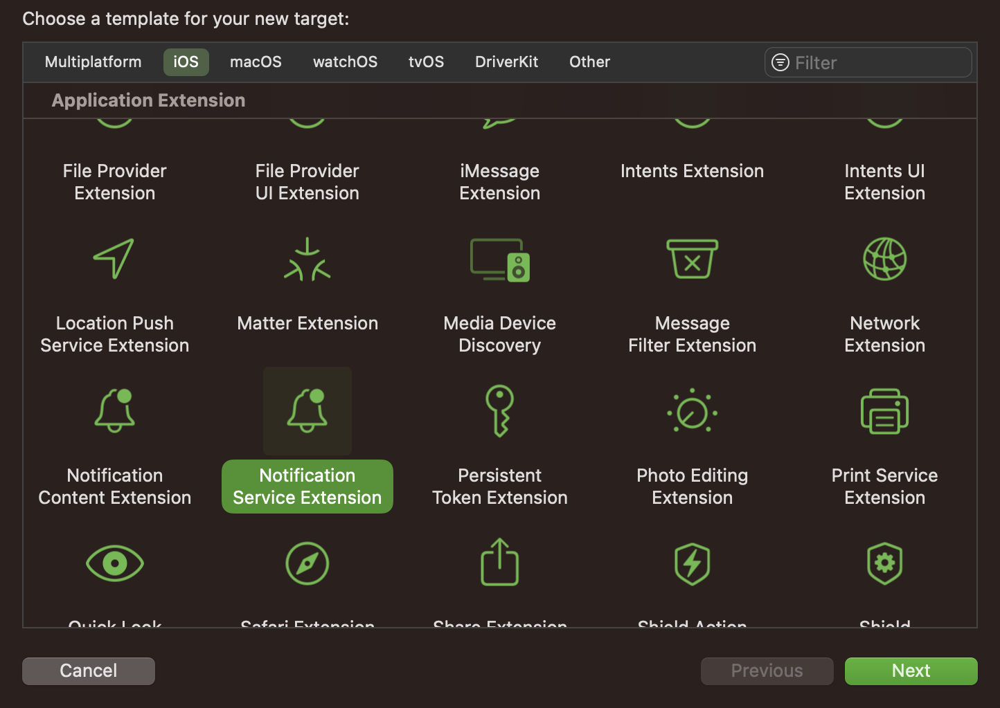
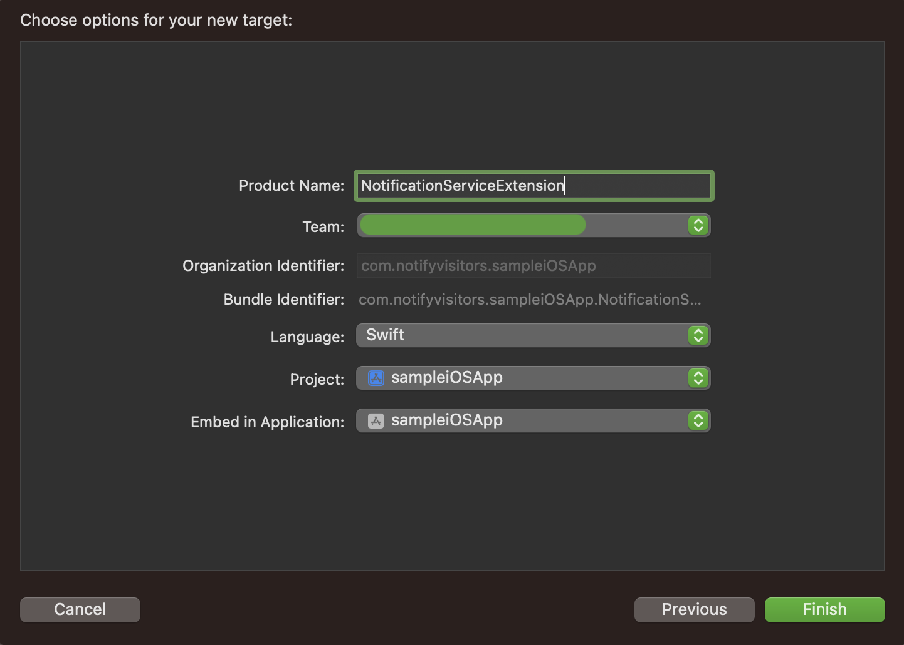
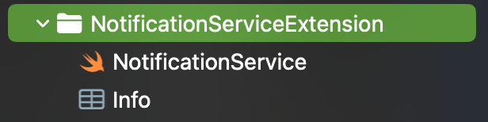
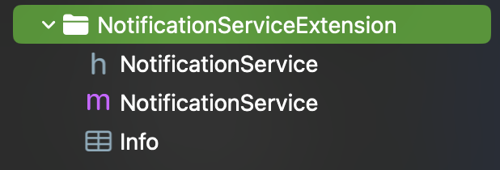
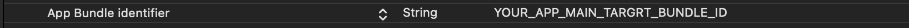
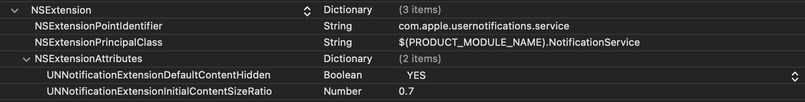
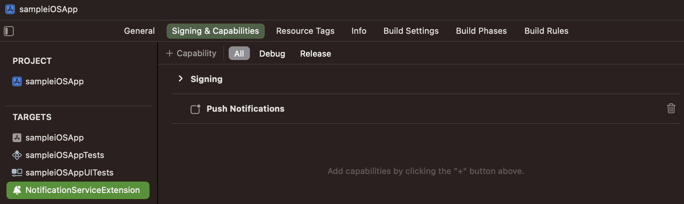

# Notification Service Extension (Flutter iOS)

Notification Service Extension has been introduced in iOS 10 by Apple which allows you to add images, audio or video content to your push notification. NVECTA SDK will use it to enable you to add Action buttons, badge counts, and to track delivery counts in your NVECTA panel as well. So It is an Important step which you need to configure properly as described in this documentation.

Official Documentation:  
https://www.nvecta.com/docs/flutter-notification-service-extension

---

## 1. Add Notification Service Extension

1.1. Now, go to the iOS folder inside your `Flutter Project's root folder` and open your iOS project in Xcode by double clicking on the `.xcworkspace` file and once your Flutter iOS project is opened in Xcode, create `Notification Service Extension` in your project. To do so, go to `File >> New >> Target`.

1.2 Now Select `Notification Service Extension` template under iOS section of the dialog box and click the next button to proceed.



1.3 In the next prompt, provide the name of the extension target and select the programming language which you want to use and then click on the Finish button as shown in the screenshot below.



1.4 Once the target is created, press 'Cancel' when prompted to activate the scheme. After this your notification service extension will be added to the project you will see a class with the extension name you specified during creation, as well as an info.plist file associated with it.

<details>
    <summary>Swift</summary>
    

</details>
<details>
    <summary>Objective-C</summary>



</details>

1.5 Now we can proceed to add further configuration to this newly created target. Under this target you need to complete Import NVECTA SDK, Configure info.plist, add code to NotificationService file and configure AppGroup properly to complete this setup.

Further steps are defined below in detail to complete this setup.

## 2. Import NVECTA SDK in your Notification Service Extension:

2.1. Now close your flutter ios project that's opened in Xcode, then open the terminal and navigate to the ios folder located within your `Flutter Project's` root folder using the `cd` command.

**For example** if your Project is saved on Desktop and its root folder name is `my_flutter_app`, then go to your project's ios folder by using the following command

```ruby
$ cd ~/Desktop/my_flutter_app/ios
```

2.2. Now go to ios folder inside your `Flutter Project's` root folder, open your `Podfile` and add the `notifyvisitorsNotificationService` dependency at the end within the `Podfile` for your `Notification Service Extension` name `target` like below.

```ruby
target 'YourNotificationServiceExtension' do
     pod 'notifyvisitorsNotificationService'
end
```

2.3 Now run the following commands in the terminal from the ios folder directory.

```ruby
$ pod repo update && pod install && cd ..
```

2.4. Now, re-open your flutter ios project in `Xcode` (by going to the ios folder present inside the `Flutter Project's` root folder) and follow the steps mentioned below in `Xcode` itself to complete the remaining `Notification Service Extension` integration process.

2.5. If you have selected `Objective-C` as the language while creating the `Notification Service Extension` in the above steps, then you can directly import our header file in your `NotificationService.m` file.

However, if you are using `Swift` language then you need to create a separate `Bridging-Header` file and then import our header file as done earlier in the app’s main target. To do so create a new header file and name it as per the following format `YOUR_ServiceExtension_NAME-Bridging-Header.h`

**For example:** if your Service Extension name is `MyNotificationServiceExtension`, then the header file name will be `MyNotificationServiceExtension-Bridging-Header.h`. Now add the following import statement in `YOUR_ServiceExtension_NAME-Bridging-Header.h` for accessing SDK Classes.

```objc
    #import <notifyvisitorsNotificationService/notifyvisitorsNotificationService.h>
```

## 📘 Note

Make sure that the path of `bridge-header.h` file is included in build settings under “Swift compiler-code generation” as: Objective C bridging header: `YOUR_ServiceExtension_NAME/YOUR_ServiceExtension_NAME-Bridging-Header.h`

## 3. Configure Service Extension’s info.plist

Now in Xcode inside the project navigator go to your `Notification Service Extension` project target and open `info.plist` as source code (right click on `info.plist` and click on `Open as >> Source code`) and add the following code in it.

```xml
<key>App Bundle identifier</key>
         <string>YOUR_APP_MAIN_TARGRT_BUNDLE_ID</string>
         <key>NSExtension</key>
         <dict>
                     <key>NSExtensionPointIdentifier</key>
                     <string>com.apple.usernotifications.service</string>
                     <key>NSExtensionPrincipalClass</key>
                     <string>$(PRODUCT_MODULE_NAME).NotificationService</string>
                     <key>NSExtensionAttributes</key>
                    <dict>
                               <key>UNNotificationExtensionDefaultContentHidden</key>
                               <true/>
                               <key>UNNotificationExtensionInitialContentSizeRatio</key>
                               <real>0.7</real>
                    </dict>
         </dict>
```

### OR

You can simply open the info.plist & add the keys which works the same as above for this.

- Add a new row by going to the menu and clicking `Editor > Add Item`. Set a key `App Bundle identifier` as `String` and set its value to your `app’s main target Bundle Identifier`.

  

- Expand `NSExtension` & add `NSExtensionAttributes` as `Dictionary`. Inside `NSExtensionAttributes` dictionary add two keys, first key is `UNNotificationExtensionDefaultContentHidden` as `Boolean`, its value should be `YES` and the second key is `UNNotificationExtensionInitialContentSizeRatio` as `Number`, its value should be `0.7`.

  

## 4. Configure Push in SignIn and Capabilities:

Go to `Signing & Capabilities` tab of your `Notification Service Extension` target and click on `+` symbol on the left corner of this tab and add `Push Notifications` and if you have upgraded `Xcode` and `Push Notifications` was already added in previous version of Xcode then remove `Push Notifications` and add it again to configure push notification properly for the upgraded devices.



## 5. Modify Push Payload in Notification Service Extension

Now you need to update the code to download and attach media content if available in your push payload to display rich media content (`image, audio or video`). To do so, go to your `NotificationService.swift/NotificationService.m` file and update the `didReceiveNotificationRequest()` method as shown below.

<details>
    <summary>Swift</summary>

```swift
override func didReceive(_ request: UNNotificationRequest, withContentHandler contentHandler: @escaping (UNNotificationContent) -> Void) {
    self.contentHandler = contentHandler
    bestAttemptContent = (request.content.mutableCopy() as? UNMutableNotificationContent)

    if let bestAttemptContent = bestAttemptContent {

        // Modify the notification content here…
        notifyvisitorsNotificationService.didReceive(request, withBestAttempt: bestAttemptContent, withContentHandler: self.contentHandler)

    }
}
```

</details>
<details>
    <summary>Objective-C</summary>

```objC
- (void)didReceiveNotificationRequest: (UNNotificationRequest *)request withContentHandler:(void (^)(UNNotificationContent * _Nonnull))contentHandler {

    self.contentHandler = contentHandler;
    self.bestAttemptContent = [request.content mutableCopy];

    // Modify the notification content here…

    [notifyvisitorsNotificationService didReceiveNotificationRequest: request withBestAttemptContent: self.bestAttemptContent withContentHandler: self.contentHandler];

}
```

</details>

Make sure `notifyvisitorsNotificationService.didReceive()` method of our SDK is called in the end of the `didReceiveNotificationRequest()` if you modify payload after calling this method then SDK may not work properly, so you can put some checks to identify your other payloads if you need to handle any.

Now in your same `NotificationService.swift/NotificationService.m` file update the `serviceExtensionTimeWillExpire()` method as shown below.

<details>
    <summary>Swift</summary>

```swift
override func serviceExtensionTimeWillExpire() {
    if let contentHandler = contentHandler, let bestAttemptContent =  bestAttemptContent {

        notifyvisitorsNotificationService.serviceExtensionTimeWillExpire()
    }
}
```

</details>
<details>
    <summary>Objective-C</summary>

```objC
- (void)serviceExtensionTimeWillExpire {

    [notifyvisitorsNotificationService serviceExtensionTimeWillExpire];

}
```

</details>

## ⚠️ Important Note

Once the above steps are completed, your app will be able to receive rich push. Action Buttons and badge counts can be displayed but till now delivery count is not enabled so you will see 0 as delivery count. To enable push delivery count in from your app to our panel, you need to follow the next step to configure AppGroup properly to enable delivery count.

# 6. Configure App Groups for All Targets:

Let's set up AppGroups in your app to count push deliveries in your NotifyVisitors panel. First, we'll select an AppGroupID and set it up in each of the info.plist of your two targets (i.e. Your App's Main Target and Your Notification Service Extension Target), and then we'll use the same AppGroupID to create and activate the same AppGroup in both target’s Signing & Capabilities Tabs. To configure this way, follow the steps listed below.
