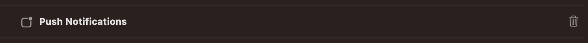
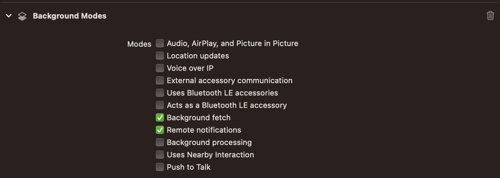

# Push Notifications (Flutter iOS)

This document explains additional push notification methods available in the NVECTA Flutter SDK, including notification preferences, subscription management, callback handling, and push interaction tracking.

Official Documentation:  
https://www.nvecta.com/docs/flutter-push-notifications

---

## 1. Configure in NVECTA Dashboard

### 1.1. Generate APNS Auth Key or APNS Certificate from Your Apple Developer Account:

You need to upload either [APNS Auth Key (recommended)](https://docs.notifyvisitors.com/docs/apns-auth-keys) or [APNS Push Certificate](https://docs.notifyvisitors.com/docs/apns-certificate) and some details from your Apple Developer Account into your NVECTA Dashboard settings. For assistance to generate one of these certificates you can refer to the one of the following doc but we recommend you to use APNS Auth Key instead of APNS Push Certificate because it expires every year and you need to renew and reupload it each year.

- [APNS Auth Keys](https://docs.notifyvisitors.com/docs/apns-auth-keys)
- [APNS Push Certificate](https://docs.notifyvisitors.com/docs/apns-certificate)

### 1.2. Upload APNS Auth Key (.p8) or APNS Certificate (.pem) file in NVECTA Account:

- After completing the previous step (1.1) you have either a .p8 file (recommended) or a .pem file (make sure to use the correct .pem file as described in the documentation because you will generate 3 different .pem files in that doc). You need to upload this file in your NVECTA account.

- Goto your `NVECTA` panel and under any one of Analytics Product and now from the left side menu goto `Settings >> App Push (under Channel section) >> iOS tab`.

- Now make sure status should be Active if not make it active state.

- Select your `Authentication Type` as per the file created in the step (1.1). If you have created `APNS Auth key (i.e. .p8 file)` then select `APNs Auth Key` but if you have created `APNS Push Certificate (i.e. .pem file)` then select `APNs Certificate` option.

- Provide the others details as shown on this page from your Apple developer account and click on `Save Changes` button after providing the details. Make sure the given details must be correct and case sensitive so if details are mismatched then push may not be delivered to the device.

- Upload the `.p8` file if you have selected `APNS Auth Key` or upload the correct `.pem` file (as described in doc) if you have selected the `APNS Certificate` option as created in previous steps.

- Now you can go to your app and configure push notifications as described in next step and after that step you can come back to your panel to create and send push notification from NVECTA panel to your iOS devices.

## 2. Configure in your App

After completing the `Configure in NVECTA Panel` step, you need to configure push in your app which includes `Register for push notifications, Enabling the Push Notifications Capability, Handling push and its click delegates`, and `Configure Notification Service Extension`. Let’s discuss each step one by one in detail.

### 2.1. Upload AP Register for push notifications:

It’s required to ask user permission first to enable push notifications on an iPhone device to do that goto your App’s `AppDelegate.swift / AppDelegate.h` file and import `User Notifications` and to handle push notifications click using delegate you need to use `UNUserNotificationCenterDelegate` in your `AppDelegate` file as shown below.

<details>
    <summary>Swift</summary>

```swift
import UserNotifications

@main
class AppDelegate: UIResponder, UIApplicationDelegate, UNUserNotificationCenterDelegate
```

</details>
<details>
    <summary>Objective-C</summary>

```objC
#import <UserNotifications/UserNotifications.h>
#import <flutter_notifyvisitors/NotifyvisitorsPlugin.h>

@interface AppDelegate : UIResponder <UIApplicationDelegate, UNUserNotificationCenterDelegate>
```

</details>

Add the following method in your `AppDelegate.swift / AppDelegate.m` file under `didFinishLaunchingWithOptions` method after SDK initialization as done in the Integration section.

<details>
    <summary>Swift</summary>

```swift
NotifyvisitorsPlugin.registerPush(withDelegate: self, app: application, launchOptions: launchOptions)

// MARK: - Example Code
func application(_ application: UIApplication, didFinishLaunchingWithOptions launchOptions: [UIApplication.LaunchOptionsKey: Any]?) -> Bool {

/* before NotifyvisitorsPlugin.nvInitialize() method */
UNUserNotificationCenter.current().delegate = self

/* after NotifyvisitorsPlugin.nvInitialize() method */
NotifyvisitorsPlugin.registerPush(withDelegate: self, app: application, launchOptions: launchOptions)
GeneratedPluginRegistrant.register(with: self)
return true
}
```

</details>
<details>
    <summary>Objective-C</summary>

```objC
[NotifyvisitorsPlugin RegisterPushWithDelegate: self App: application launchOptions: launchOptions];

// MARK: - Example Code
- (BOOL)application:(UIApplication *)application didFinishLaunchingWithOptions:(NSDictionary *)launchOptions {

    /* before NotifyvisitorsPlugin Initialize method */
    [UNUserNotificationCenter currentNotificationCenter].delegate = self;

    /* after NotifyvisitorsPlugin Initialize method */
    [NotifyvisitorsPlugin RegisterPushWithDelegate:self App:application launchOptions:launchOptions];

    [GeneratedPluginRegistrant registerWithRegistry:self];
    return [super application:application didFinishLaunchingWithOptions:launchOptions];
    }
```

</details>

Now add the following delegate method in your `AppDelegate.swift / AppDelegate.m` file to handle the registering events of push notification.

<details>
    <summary>Swift</summary>

```swift

func application(_ application: UIApplication, didRegisterForRemoteNotificationsWithDeviceToken deviceToken: Data) {

    NotifyvisitorsPlugin.application(application, didRegisterForRemoteNotificationsWithDeviceToken: deviceToken)

}

func application(_ application: UIApplication, didFailToRegisterForRemoteNotificationsWithError error: Error) {

    NotifyvisitorsPlugin.application(application, didFailToRegisterForRemoteNotificationsWithError: error)

}
```

</details>
<details>
    <summary>Objective-C</summary>

```objC

-(void)application:(UIApplication*)application didRegisterForRemoteNotificationsWithDeviceToken:(NSData *)deviceToken {

    [NotifyvisitorsPlugin application: application didRegisterForRemoteNotificationsWithDeviceToken: deviceToken];

}

-(void)application:(UIApplication*)application didFailToRegisterForRemoteNotificationsWithError:(NSError*) error {

    [NotifyvisitorsPlugin application: application didFailToRegisterForRemoteNotificationsWithError: error];

    }
```

</details>

### 2.2. Configure Push in SignIn and Capabilities:

Goto `Signing & Capabilities` tab and click on `+` symbol on the left corner of this tab and add `Push Notifications` and if you have `upgraded Xcode` and `Push Notifications` was already added in previous version of Xcode then remove `Push Notifications` and add it again to configure push notification properly for the upgraded devices.



Again in the `Signing & Capabilitie`s tab if `Background Modes` is not already added then click on the `+` symbol again and add `Background Modes` make sure to select `2 checkboxes`. If it is already added then make sure to select `2 checkboxes` (i.e. `Background fetch`, `Remote notifications`) as shown in the screenshot below.



### 2.3. Handling Push Notifications Delegates & Its Clicks:

Now by using `UNUserNotificationCenterDelegate` protocol in your `AppDelegate.swift / AppDelegate.m` file you need to implement below given delegate methods to handle push receiving (while app is in foreground) and push click events as described below.

<details>
    <summary>Swift</summary>

```swift
func userNotificationCenter(_ center: UNUserNotificationCenter, willPresent notification: UNNotification, withCompletionHandler completionHandler: @escaping (UNNotificationPresentationOptions) -> Void) {

    NotifyvisitorsPlugin.willPresent(notification, withCompletionHandler: completionHandler)

}

func application(_ application: UIApplication, didReceiveRemoteNotification userInfo: [AnyHashable : Any], fetchCompletionHandler completionHandler: @escaping (UIBackgroundFetchResult) -> Void) {

    NotifyvisitorsPlugin.application(application, didReceiveRemoteNotification: userInfo)

}

func userNotificationCenter(_ center: UNUserNotificationCenter, didReceive response: UNNotificationResponse, withCompletionHandler completionHandler: @escaping () -> Void) {

    NotifyvisitorsPlugin.didReceive(response)

}

```

</details>
<details>
    <summary>Objective-C</summary>

```objc
-(void)userNotificationCenter:(UNUserNotificationCenter *)center willPresentNotification:(UNNotification *)notification withCompletionHandler:(void (^)(UNNotificationPresentationOptions))completionHandler {

    [NotifyvisitorsPlugin willPresentNotification:notification withCompletionHandler:completionHandler];

}

-(void)application:(UIApplication *)application didReceiveRemoteNotification:(NSDictionary *)userInfo fetchCompletionHandler:(void (^)(UIBackgroundFetchResult))completionHandler {

    [NotifyvisitorsPlugin application:application didReceiveRemoteNotification:userInfo fetchCompletionHandler:completionHandler];

}

-(void)userNotificationCenter:(UNUserNotificationCenter*)center didReceiveNotificationResponse: (UNNotificationResponse*)response withCompletionHandler:(void (^)(void))completionHandler {

    [NotifyvisitorsPlugin didReceiveNotificationResponse:response];

}
```

</details>

### 2.4. Enable Rich Media Content by using Notification Service Extension:

Till the above steps are completed you will be able to receive only text content (i.e. title and message text) in push notifications and also delivery count can not be tracked in NVECTA panel. You need to configure `Notification Service Extension` along with AppGroup properly to complete `Push integration` and it will enable your push notification to receive `rich media (image, audio or video)` and also NVECTA SDK used it to enable you to add `Action buttons, badge counts and to track delivery counts` in your NVECTA panel.

You need to refer to our [Notification Service Extension](/docs/ios-notification-service-extension.md) guide for detailed configuration steps for the same.
