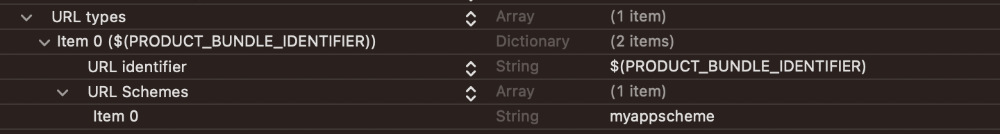
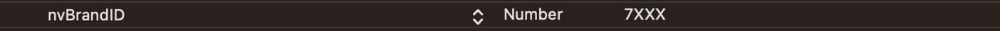
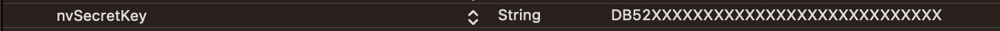
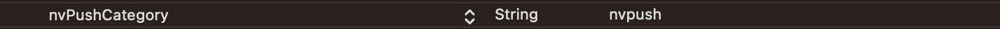
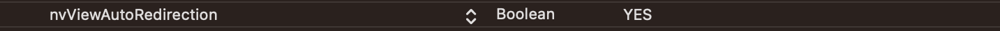

# iOS Integration

This document explains the iOS-specific integration steps required for the Flutter plugin.

Official Documentation:  
https://www.nvecta.com/docs/flutter-ios-integration

---

<br>

# 1. Cocoapods Install

Once you have completed the Plugin Installation step, inside the terminal, go to the ios folder located within your Flutter Project root folder using cd command, then run this command from terminal

```ruby
    cd ios && pod install && cd ..
```

For example, if your Project is saved on Desktop and its root folder name is my_flutter_app, then go to your project's ios folder by using the following command

```ruby
    $ cd ~/Desktop/my_flutter_app/ios && pod install && cd ..
```

---

# 2. Configure info.plist

To configure your info.plist, go to ios folder inside your Flutter Project root folder and open your iOS project into Xcode by double click on `.xcworkspace` file and once your Flutter iOS project is open in Xcode, go to `info.plist`, open `info.plist` file as source code (right-click on info.plist and click on Open as >> Source code) and add the following code in it.

```xml
 <key>CFBundleURLTypes</key>
  <array>
        <dict>
      <key>CFBundleURLName</key>
     	<string>$(PRODUCT_BUNDLE_IDENTIFIER)</string>
             	<key>CFBundleURLSchemes</key>
             	<array>
 	<string>"yourURLscheme comes here"</string>
         </array>
     	</dict>
          </array>
<key>nvBrandID</key>
         <integer>Your BRANDID comes here</integer>
              <key>nvSecretKey</key>
	        <string>Your SECRET KEY comes here</string>
             <key>nvPushCategory</key>
                       <string>nvpush</string>
             <key>nvViewAutoRedirection</key>
                       <true/>       <!--OR--> <!-- <false/>-->
```

### OR

You can simply open the `info.plist` file as `Property List` and add the keys which work the same as above.

1. Add a new row again and set up a URL Types item by means of adding a new item. Expand the URL Types key, then expand Item 0, and add a new item, URL Identifier . Fill in 'appScheme' for Item 0 of URL schemes and your company identifier for the URL Identifier. Once done, your file should resemble the image provided below.

   

2. Add a new row again and set up a `nvBrandID` as Number and fill this field with your `BRANDID`

   

3. Add a new row again and set up a `nvSecretKey` as String and fill this field with your `SECRET KEY`

   

4. Add a new row again and set up a `nvPushCategory` as String and set it’s value nvpush.

   

5. Add a new row again and set up a key `nvViewAutoRedirection` as Boolean. Set it `YES` to enable auto redirection of your app’s `ViewControllers` from SDK or set it NO to handle redirections by your app.

   

## ⚠️ Important Note

In the example provided above, dummy Brand ID and Secret Key has been mentioned. Kindly login to your account to see your credentials.

# 3. Import Header File

### Objective-C

Import the notifyvisitors header file in each file in which the SDK function is to be accessed as given below.

```objc
    #import <flutter_notifyvisitors/NotifyvisitorsPlugin.h>
```

### Swift

If your project iOS platform is in Swift language then you have to create a `Bridging-Header.h` file.
In this file you can import NVECTA (Formally Notifyvisitors) SDK to use it in your project's swift files. To do so create a new header file and name it as per the following format. `YOUR_FLUTTER_IOS_PROJECT_NAME-Bridging-Header.h`

For example, if your project name is Runner. Then the header file name will be Runner-Bridging-Header.h. Now add the following import statement in `YOUR_FLUTTER_IOS_PROJECT_NAME-Bridging-Header.h` for accessing SDK Classes.

```objc
    #import "NotifyvisitorsPlugin.h"
```

## 📘 Note

Make sure that the path of `bridge-header.h` file is included in build settings under “Swift compiler-code generation” as: Objective C bridging header: `YOUR_FLUTTER_IOS_PROJECT_NAME/YOUR_FLUTTER_IOS_PROJECT_NAME-Bridging-Header.h`

> # 4. Initialise SDK
>
> **Step 1.** Initialize the SDK in the application `didFinishLaunchingWithOptions` function.
>
> <details>
> <summary>Swift</summary>
>
> ```swift
> NotifyvisitorsPlugin.nvInitialize()
>
> // MARK: - Example Code
>
> override func application(_ application: UIApplication, didFinishLaunchingWithOptions launchOptions: [UIApplication.LaunchOptionsKey: Any]?) -> Bool {
>
>    // NotifyVisitors methods here
>    NotifyvisitorsPlugin.nvInitialize()
>    // ----------------------------
>
>    GeneratedPluginRegistrant.register(with: self)
>    return super.application(application, didFinishLaunchingWithOptions: launchOptions)
> }
> ```
>
> </details>
>
> <details>
> <summary>Objective-C</summary>
>
> ```objC
> [NotifyvisitorsPlugin nvInitialize];
>
> // MARK: - Example Code
> - (BOOL)application:(UIApplication *)application didFinishLaunchingWithOptions:(NSDictionary *)launchOptions {
>
>  // NotifyVisitors methods here
>    [NotifyvisitorsPlugin Initialize];
>  // ----------------------------
>
>   [GeneratedPluginRegistrant registerWithRegistry:self];
>    return [super application:application didFinishLaunchingWithOptions:launchOptions];
> }
> ```
>
> </details>
> </br>
>
> **Step 2.** Add the following method in `applicationDidEnterBackground` in your AppDelegate file.
>
> <details>
> <summary>Swift</summary>
>
> ```swift
> NotifyvisitorsPlugin.applicationDidEnterBackground(application)
>
> // MARK: - Example Code
> override func applicationDidEnterBackground(_ application: UIApplication) {
>  NotifyvisitorsPlugin.applicationDidEnterBackground(application)
>    }
> ```
>
> </details>
> <details>
> <summary>Objective-C</summary>
>
> ```objC
> [NotifyvisitorsPlugin applicationDidEnterBackground: application];
>
> // MARK: - Example Code
> - (void)applicationDidEnterBackground:(UIApplication \*)application {
>   [NotifyvisitorsPlugin applicationDidEnterBackground: application];
>   }
> ```
>
> </details>
> </br>
>
> **Step 3.** Add the following method in `applicationWillEnterForeground` in your AppDelegate file.
>
> <details>
> <summary>Swift</summary>
>
> ```swift
> NotifyvisitorsPlugin.applicationWillEnterForeground(application)
>
> // MARK: - Example Code
> override func applicationWillEnterForeground(_ application: UIApplication) {
>        NotifyvisitorsPlugin.applicationWillEnterForeground(application)
>    }
> ```
>
> </details>
> <details>
> <summary>Objective-C</summary>
>
> ```objC
> [NotifyvisitorsPlugin applicationWillEnterForeground: application];
>
> // MARK: - Example Code
> - (void)applicationWillEnterForeground:(UIApplication *)application {
>  [NotifyvisitorsPlugin applicationWillEnterForeground: application];
> }
> ```
>
> </details>
> </br>
>
> **Step 4.** Add the following method in `applicationDidBecomeActive` in your AppDelegate file.
>
> <details>
> <summary>Swift</summary>
>
> ```swift
> NotifyvisitorsPlugin.applicationDidBecomeActive(application)
>
> // MARK: - Example Code
> override func applicationDidBecomeActive(_ application: UIApplication) {
>        NotifyvisitorsPlugin.applicationDidBecomeActive(application)
>    }
> ```
>
> </details>
> <details>
> <summary>Objective-C</summary>
>
> ```objC
> [NotifyvisitorsPlugin applicationDidBecomeActive: application];
>
> // MARK: - Example Code
> - (void)applicationDidBecomeActive:(UIApplication *)application {
>  [NotifyvisitorsPlugin applicationDidBecomeActive: application];
> }
> ```
>
> </details>
> </br>
>
> **Step 5.** Add the following method in `applicationWillTerminate` in your AppDelegate file.
>
> <details>
> <summary>Swift</summary>
>
> ```swift
> NotifyvisitorsPlugin.applicationWillTerminate()
>
> // MARK: - Example Code
> override func applicationWillTerminate(_ application: UIApplication) {
>        NotifyvisitorsPlugin.applicationWillTerminate()
>    }
> ```
>
> </details>
> <details>
> <summary>Objective-C</summary>
>
> ```objC
> [NotifyvisitorsPlugin applicationWillTerminate];
>
> // MARK: - Example Code
> - (void) applicationWillTerminate:(UIApplication *)application{
>    [NotifyvisitorsPlugin applicationWillTerminate];
> }
> ```
>
> </details>
> </br>
>
> **Step 6. Deep Linking:** Use the following method in your AppDelegate `openURL` method that will check the deep-linking and open your app from custom URL Scheme.
>
> <details>
> <summary>Swift</summary>
>
> ```swift
> NotifyvisitorsPlugin.openUrl(app, open: url)
>
> // MARK: - Example Code
> override func application(_ app: UIApplication, open url: URL, options: [UIApplication OpenURLOptionsKey : Any] = [:]) -> Bool {
>        NotifyvisitorsPlugin.openUrl(app, open: url)
>        return super.application(app, open: url)
>    }
> ```
>
> </details>
> <details>
> <summary>Objective-C</summary>
>
> ```objC
> [NotifyvisitorsPlugin openUrl:app openURL:url];
>
> // MARK: - Example Code
> -(BOOL)application:(UIApplication *)app openURL:(NSURL *)url options (NSDictionary<UIApplicationOpenURLOptionsKey,id> *)options {
>
> [NotifyvisitorsPlugin openUrl:app openURL:url];
> return [super application: app openURL: url options: options];
> }
> ```
>
> </details>
> </br>

</br>

# 5. Push Notifications

NotifyVisitors Flutter plugin enables you to send push notifications to your mobile apps from our dashboard. Kindly refer to our [Push Notifications](/docs/ios-push-integration.md) integration guide available on the next page.

<br>

# Support

If you face any issues during integration, please contact the support team or raise an issue directly from the NVECTA Dashboard.
